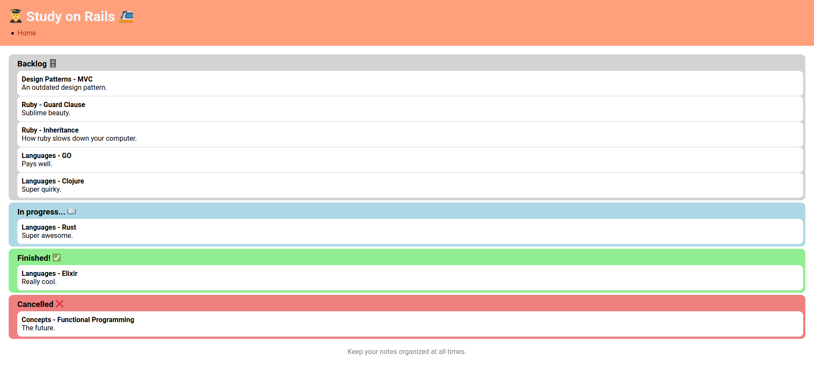

# Study on Rails

<div align="center">
  
</div>

## Table of Contents

- [About](#about)
- [Getting Started](#getting_started)
- [Usage](#usage)
- [Routes](#routes)
- [Docs](#docs)
- [Resources](#resources)

## About <a name = "about"></a>

A simple Rails app that helps you manage your studies, similar to
[this CLI project](https://github.com/librity/campus_code_study_diary_cli).

## Getting Started <a name = "getting_started"></a>

### Prerequisites

- ruby 2.7.1

### Installing

Clone this repo locally and run the setup script:

```
$ git clone https://github.com/librity/campus_code_study_diary
$ cd campus_code_study_diary
$ bin/setup
```

Migrate and seed the database:

```
$ bundle exec rails db:migrate
$ bundle exec rails db:seed
```

If everythig installed correctly, start the development server with:

```
$ bundle exec rails server
```

And open [http://localhost:3000](http://localhost:3000) on your browser.

## Usage <a name = "usage"></a>

You will be able to create, read, update and destroy Study Items from the
interface. All data is persisted in an SQLite3 database.

### Routes <a name = "routes"></a>

- `GET` http://localhost:3000

## Docs <a name = "docs"></a>

- https://guides.rubyonrails.org/
- https://github.com/puma/puma/

- https://guides.rubyonrails.org/active_record_callbacks.html
- https://guides.rubyonrails.org/form_helpers.html

## Resources <a name = "resources"></a>

- https://fonts.google.com/specimen/Roboto?preview.text_type=custom
- https://emojipedia.org
- https://favicon.io/emoji-favicons/open-book
- https://stackoverflow.com/questions/9901910/how-to-add-favicon-in-rails-3-2
- https://rubyinrails.com/2020/05/26/rails-first-or-create-vs-find-or-create-by/
